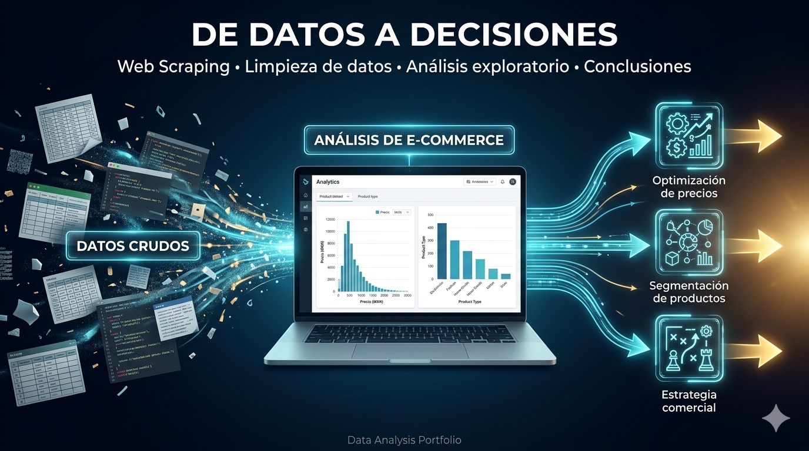
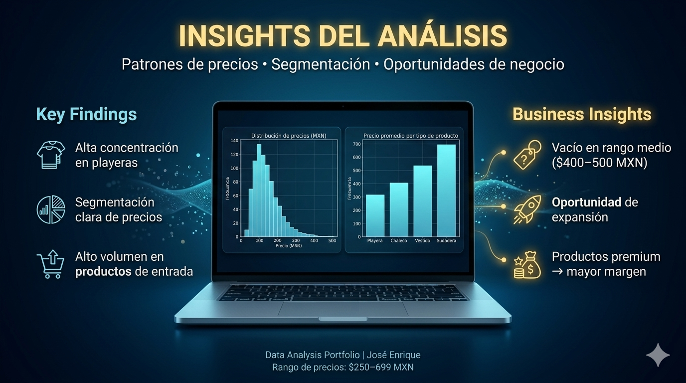

# 📊 E-commerce Web Scraping & Data Analysis

From raw data to business insights.

---

## 📌 Project Overview

This project analyzes an e-commerce store using web scraping, data cleaning, and exploratory data analysis.

The goal was to extract real product data, transform it into a structured dataset, and generate actionable business insights.

---

## ⚙️ Process

1. **Web Scraping**
   - Extracted product data from the online store
   - Collected product names, prices, and URLs

2. **Data Cleaning**
   - Standardized price formats (MXN → numeric)
   - Removed duplicate products
   - Created structured features (product type)

3. **Exploratory Data Analysis**
   - Price distribution analysis
   - Product segmentation
   - Category-level insights

---

## 📊 Key Insights

- High concentration of products in **t-shirts (playeras)**
- Clear **price segmentation**:
  - Entry-level: ~$250–380 MXN
  - Premium: ~$550–700 MXN
- Identified a **gap in mid-range pricing ($400–500 MXN)**
- Premium products (sweatshirts) show **higher revenue potential**

---

## 💡 Business Recommendations

- Explore the **mid-price segment** to capture new customers
- Expand premium product lines to increase margin
- Optimize entry-level products for volume (bundles, promotions)
- Diversify underrepresented categories (vestidos, chalecos)

---

## 🛠️ Tools Used

- Python (Pandas, BeautifulSoup)
- Jupyter Notebook
- Data Visualization (Matplotlib)

---

## 📂 Project Structure
africam-ecommerce-analysis/
│
├── images/
│ ├── cover.png
│ └── insights.png
│
├── caso_estudio_ecommerce_africam_final.ipynb
└── README.md

---

## 🚀 What I Learned

- Importance of clean data pipelines from extraction
- Handling messy real-world data (HTML → structured data)
- Translating data into business insights

---

## 👤 Author

José Enrique Piñango  
Data Analyst | Python | SQL | Tableau

---

## 🔗 Connect with me

- LinkedIn: https://www.linkedin.com/in/josé-enrique-piñango-analisisdedatos/

